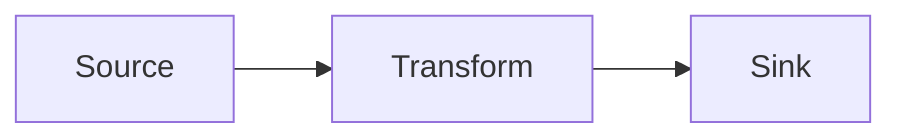

# <Topic Title>

> One sentence stating what this note teaches and when you'd reach for it.

## Context

Why this came up. The problem, constraint, or goal that motivated the work. Enough
background that the rest of the note makes sense to someone (including future you)
who wasn't in the session.

## Solution architecture

<!-- Mermaid diagram — see diagram-conventions.md. Color by tier, thicken the hot path. -->



A short walkthrough of the diagram: what each component is, how data moves, and why
the shape is what it is. If you weighed multiple architectures, show them side by side
and say which won and why.

## How it works

Step-by-step walkthrough. Each code block is preceded by a sentence explaining what it
does and why it's written that way. Use real snippets from the session.

```text
<code>
```

## Key decisions & trade-offs

- **<decision>** — why we chose it, and the alternative(s) we rejected.

## Gotchas

- The non-obvious thing that bit us, and how to avoid it.

## References

- [[Related note]]
- Repo / external docs

## Next steps

- Open items and follow-ups (omit if none).
