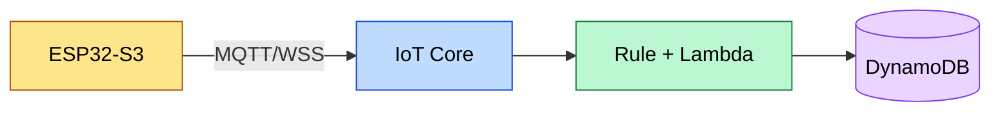
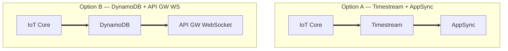

# Mermaid architecture diagram conventions

A diagram earns its place by letting the reader grasp the *shape* of a system in one
glance — the tiers it spans and where the important data flows. These conventions make
that legible at a glance and consistent across notes.

## 1. Color by tier

Group nodes into the layers the data passes through and give each layer one color via
`classDef`. Typical tiers (adapt to the topic — a CLI tool won't have a "cloud" tier):

| Tier            | Fill      | Stroke    | Examples                                |
|-----------------|-----------|-----------|-----------------------------------------|
| Device / edge   | `#fde68a` | `#b45309` | sensor, microcontroller, browser, CLI   |
| Network / transport | `#bfdbfe` | `#1d4ed8` | HTTP, MQTT, queue, CDN                |
| Compute / logic | `#bbf7d0` | `#15803d` | Lambda, service, handler, daemon        |
| Storage / state | `#e9d5ff` | `#7c3aed` | DB, object store, cache, file           |
| Presentation    | `#fbcfe8` | `#be185d` | dashboard, website, report              |

## 2. Edge weight = importance of the data path

The main path the system exists to serve should be visually heaviest; control/config/
fallback paths should recede. Use Mermaid's link styling:

- **Hot path** (the primary data flow): thick line — `A ==> B`.
- **Normal path**: standard arrow — `A --> B`.
- **Occasional / control / fallback path**: dotted — `A -.-> B`.

Label edges with the protocol or payload (`-->|MQTT 1/s|`) when it aids understanding.

## 3. Side-by-side option diagrams

When the note documents a decision between architectures, draw each option in its own
`subgraph` and add a comparison table (latency, cost shape, components, trade-off). The
diagram shows the structural difference; the table makes the choice defensible.

## 4. Keep it honest and minimal

- Draw what was actually built (or actually considered), not an idealized version.
- One concept per diagram. If it needs a legend longer than the diagram, split it.
- Prefer `flowchart` for structure/data flow, `sequenceDiagram` for request/response
  handshakes, `stateDiagram-v2` for state machines.
